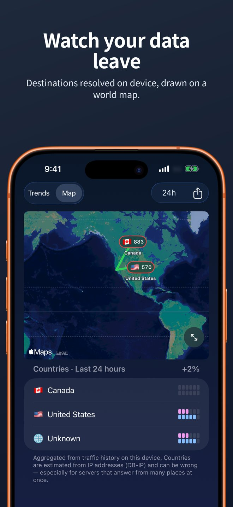
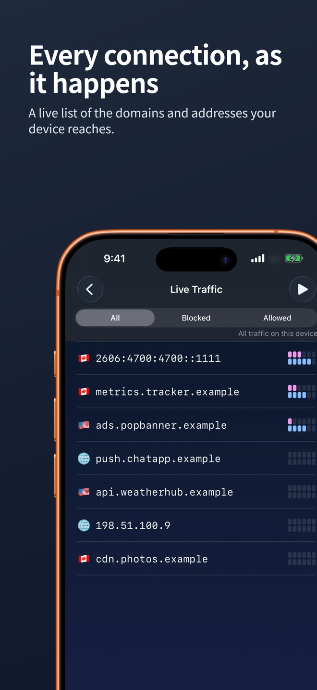
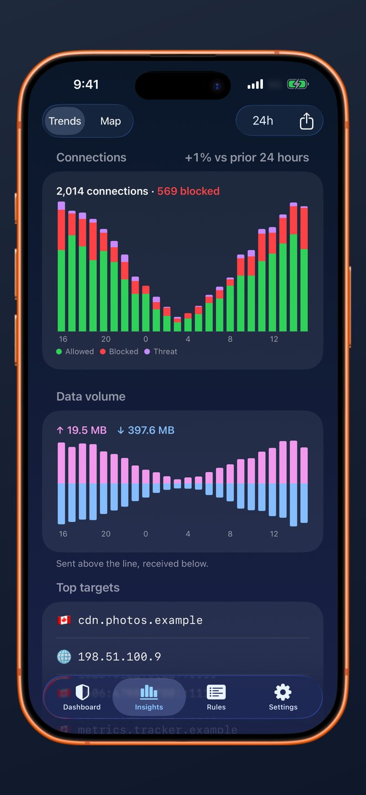
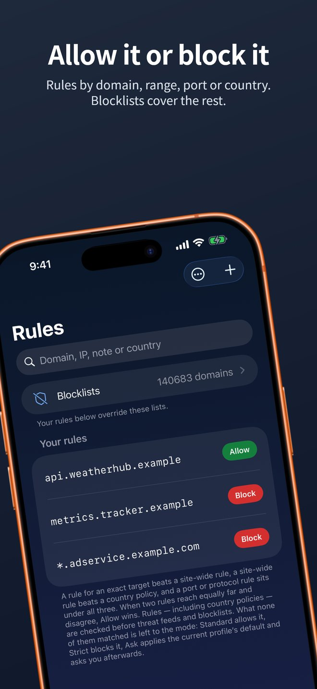

# FluxMoat

[English](README.md) | **简体中文**

FluxMoat 是一个 iPhone 应用：它把手机发出的每一条网络连接列出来，你不想要的可以直接拦掉。实现方式是在手机本地跑一个数据包隧道（packet tunnel）。没有 VPN 服务器，不需要账号，也没有后端；隧道记录下的任何内容都不会被发送出去。

<p align="center">
  
  
</p>
<p align="center">
  
  
  
</p>

> 截图中的应用界面为英文，应用目前只提供英文版。

## 目录

- [功能](#功能)
- [工作原理](#工作原理)
- [一条连接如何被判定](#一条连接如何被判定)
- [隐私](#隐私)
- [局限](#局限)
- [自行编译](#自行编译)
- [目录结构](#目录结构)
- [日常维护](#日常维护)
- [参与贡献](#参与贡献)
- [许可证](#许可证)

## 功能

### 首页（Dashboard）

一个开关控制防护的开启和关闭。下方的图表显示最近一小时发送和接收的流量，再往下是按国家归类的最近连接目标，点开某个国家可以看到具体的主机。

### 实时流量（Live Traffic）

连接一发生就会出现在列表里：域名（能识别时）或 IP 地址、端口、协议、上下行字节数、所在国家的估计，以及放行还是拦截。可以按“全部 / 已拦截 / 已放行”筛选，可以暂停列表慢慢看，点某一行能看详情，也能直接为它建一条规则。

### 规则（Rules）

规则可以放行或拦截以下任一种目标：

| 目标 | 示例 |
| --- | --- |
| 精确域名 | `api.example.com` |
| 整个站点 | `*.example.com` |
| IP 地址 | `203.0.113.7` |
| 网段 | `203.0.113.0/24` |
| 端口或协议 | TCP 853 端口，或协议号 17 |
| 国家 | 估计位于该国的所有目的地（只能拦截） |

规则可以设置到期时间、写备注、只对某个配置生效，也可以临时停用而不删除。规则可以导出、导入为 FluxMoat 自己的 JSON 格式，信息完整不丢；也可以与 Little Snitch 的规则文件（`.lsrules`）互相导入导出，不过这种格式无法表达到期时间和国家策略，这两项不会带过去。

### 拦截名单与威胁情报

默认列出三个来源：

- **StevenBlack hosts**：广告、追踪器和已知恶意域名。
- **Feodo Tracker**（abuse.ch）：僵尸网络的控制服务器。
- **ThreatFox**（abuse.ch）：近期的恶意软件指标（域名和 IP）。

在你点“更新”之前不会下载任何内容。第一次下载之后，已启用的名单会在应用打开时每隔至少六小时检查一次；名单没有变化时，只花一次条件请求。你也可以通过网址添加自己的名单，支持 hosts 文件、域名列表、IP 列表、CIDR 列表和 ThreatFox 格式的 JSON 清单，并归到“广告与追踪”或“威胁”类。

ThreatFox 通过一个公开镜像获取，因此不需要 abuse.ch 账号。如果你填了自己的 abuse.ch Auth-Key，应用只会把它发给 abuse.ch 的服务器。

### 模式与配置（Profile）

没有被任何规则和名单命中的连接，由模式来决定：

- **Standard**：放行。
- **Strict**：拦截。
- **Ask**：按当前配置的默认动作处理，事后通知你，方便你把它变成一条规则。提醒会合并、限频，也可以设置免打扰时段。

有两个配置：**Home** 和 **Public**。可以手动切换，可以用快捷指令切换，也可以按 Wi-Fi 网络自动切换（应用会记住每个网络对应哪个配置）。

### 统计（Insights）

按 24 小时、7 天、30 天或全部时间，统计连接数（放行 / 拦截 / 威胁）和数据量，并与上一个同等时段比较。另有连接最多的目标、被拦最多的目标、首次出现的目标三个列表。地图视图按国家标出目的地。任何一个视图都可以分享成图片卡片，默认只带数字，不带主机名，除非你选择加上。

### 加密 DNS

默认关闭，此时使用系统的 DNS。可以选 Quad9、Cloudflare Security（1.1.1.2）、Cloudflare（不过滤），或者自定义的 DNS over HTTPS 地址（比如 NextDNS）。另有一个开关可以阻止其他应用使用常见的公共 DoH / DoT 解析器，否则它们可以绕过域名规则。

### 其他

- **历史保留**：7 天、30 天、90 天、6 个月或 12 个月；可以把全部历史导出为 CSV，也可以一键清空。
- **iCloud 同步**：通过你自己的 CloudKit 私有数据库，在你的设备之间同步规则、设置、Wi-Fi 自动切换和名单订阅。流量历史和 abuse.ch 密钥永远不同步。
- **快捷指令动作**：Turn Protection On、Turn Protection Off、Set Profile、Set Mode。
- **主屏小组件**：显示防护状态和今天拦截的数量。
- **每周小结**（可选）通知，点开直接看最近 7 天的统计。
- **问题反馈**：生成一份只含设置和计数的诊断摘要，先完整展示给你看，由你决定是否发送。

## 工作原理

```
iOS 网络栈
  │  全部 IPv4 / IPv6 流量（默认路由）
  ▼
Packet Tunnel 扩展
  ├─ leaf（tun2socks）
  │    把原始数据包重组成 TCP / UDP 连接
  │    用占位地址应答 DNS，这样每条连接到达时
  │    都带着它最初请求的主机名
  │
  │  SOCKS5 到 127.0.0.1（同一进程内）
  ▼
  └─ SOCKS5 服务 + 规则引擎
       为每条连接判定放行或拦截
       放行的连接直接连到真实目的地
       每条连接往 events.sqlite 写一行记录

App Group 共享目录（应用与扩展共用）
  rules-snapshot.json   应用写入，隧道读取
  events.sqlite         隧道写入，应用读取

FluxMoat 应用
  生成规则快照、读取历史、绘制界面
```

- 隧道的远端地址是 `127.0.0.1`，数据包不会经隧道离开手机；放行的连接直接连到它原本的目的地。
- 应用和扩展共用一个 App Group 目录。应用把规则、名单和当前配置编译成 `rules-snapshot.json`，隧道收到重新加载的通知后读取并替换。校验和不对或格式版本不认识的快照会被拒绝，继续使用上一份有效的快照。
- 流量历史由隧道写进同一目录下的 SQLite 数据库，应用从中读取。
- 隧道开启时，iOS 显示的 DNS 服务器是 `1.1.1.1`。这个地址只是把 DNS 查询引进隧道，由本地应答。
- 扩展必须控制在 Network Extension 的内存上限以内（约 50 MB），所以缓冲区有上限，UDP 表有容量限制，空闲条目会被回收。
- 隧道启动失败时会上报错误，iOS 随即移除隧道，手机回到正常网络，而不是断网。
- 国家估计来自应用自带的 DB-IP Lite 数据库，查询只在应用里进行，从不在隧道里进行。

## 一条连接如何被判定

1. 针对精确目标的规则优先于整站规则，整站规则优先于国家策略，端口或协议规则排在三者之后。
2. 两条同样具体的规则结论相反时，放行优先。
3. 规则（包括国家策略）先于威胁情报和拦截名单检查。想给名单开例外，就加一条放行规则。
4. 什么都没命中时由模式决定：Standard 放行，Strict 拦截，Ask 按配置默认动作处理并通知你。

## 隐私

只保存在手机上的内容：时间、目的 IP、主机名（来自手机自己的 DNS 查询）、端口、协议、收发字节数、判定结果和做出判定的规则、当前配置、国家估计、网络类型。从不保存数据内容、网页内容、完整网址或凭据。不解密 HTTPS，也不安装任何证书。

应用里没有统计分析、崩溃上报或广告 SDK，项目也没有任何接收应用数据的服务器。应用只在以下情况访问网络：

| 目的地 | 何时 | 发送什么 |
| --- | --- | --- |
| `feeds.hominexis.com` | 启用 ThreatFox 并点了更新，之后应用打开时每 6 小时一次 | 普通 HTTPS GET 请求 |
| `raw.githubusercontent.com` | 同上，StevenBlack hosts | 普通 HTTPS GET 请求 |
| `feodotracker.abuse.ch` | 同上，Feodo Tracker | 普通 HTTPS GET 请求 |
| abuse.ch 相关服务器 | 仅当你填了自己的 Auth-Key | GET 请求加你的密钥 |
| 你选的 DoH 解析器 | 仅当你开启了加密 DNS | 你的 DNS 查询 |
| 你自定义的名单网址 | 仅当你添加了 | 普通 HTTPS GET 请求 |
| Apple iCloud（CloudKit） | 仅当你开启了 iCloud 同步 | 你的规则和设置，写入你的私有数据库 |

位置权限是可选的，只用来在统计地图上画出连线的起点。第一次打开地图时以“大致位置”的精度申请，只保存在内存里，从不写入存储，也不发送出去。

## 局限

- iOS 不会告诉数据包隧道是哪个应用发起的连接，所以流量是按整台设备显示的。
- 只能看到连接的元数据，看不到 HTTPS 的内容。
- Ask 模式是事后处理：提醒弹出时，连接不会被挂起等待。
- 国家是按 IP 地址估计的，可能不准，对从多地同时应答的 CDN 尤其如此。
- 使用自带加密 DNS 的应用可以绕过域名规则，IP 规则仍然有效；“Block other encrypted DNS”开关能挡住常见的情况。
- 暂不过滤 ICMP（ping），所以 ICMP 规则不起作用。
- iOS 同一时间只能运行一个这类 VPN，打开别的 VPN 会关掉 FluxMoat。

## 自行编译

### 需要准备

- 一台装有 Xcode 26 或更新版本的 Mac（项目用 Xcode 27 开发）。
- 一部 iOS 18 或更新版本的 iPhone。
- **付费的** Apple Developer Program 会员。数据包隧道需要 Network Extension 权限，免费的个人开发者账号拿不到。

### 步骤

1. 克隆仓库。

   ```
   git clone https://github.com/<you>/fluxmoat.git
   cd fluxmoat
   ```

2. 新建 `FluxMoat/Config/Signing.local.xcconfig`，填入你的 Team ID 和一个属于你的 Bundle 前缀。这个文件不会被 git 跟踪。

   ```
   DEVELOPMENT_TEAM = ABCDE12345
   FLUXMOAT_BUNDLE_PREFIX = com.yourname.fluxmoat
   ```

   其余标识都由前缀推出：

   | 项目 | 值 |
   | --- | --- |
   | 应用 | `com.yourname.fluxmoat` |
   | 数据包隧道 | `com.yourname.fluxmoat.packettunnel` |
   | 小组件 | `com.yourname.fluxmoat.widgets` |
   | App Group | `group.com.yourname.fluxmoat` |
   | iCloud 容器 | `iCloud.com.yourname.fluxmoat` |

3. 打开 `FluxMoat/FluxMoat.xcodeproj`。第一次打开时，Swift Package Manager 会下载 leaf 框架（带校验和）。
4. 选择 `FluxMoatApp` scheme 和你的 iPhone，点运行。使用自动签名时，Xcode 会在你的团队下注册这几个 Bundle ID、App Group 和 iCloud 容器，弹窗询问时允许即可。
5. 在手机上打开 FluxMoat，打开防护，iOS 询问是否添加 VPN 配置时选择允许。

### 注意事项

- **模拟器**：Network Extension 不能在模拟器里运行。模拟器构建使用一个模拟隧道，会生成示例流量，用来做界面开发足够了。
- **iCloud 同步**：Debug 构建使用 CloudKit 开发环境，数据结构在第一次写入时自动创建。如果要发 TestFlight 或 App Store，先在 CloudKit Console 把数据结构（只有一个记录类型 `FluxMoatConfig`）部署到生产环境。
- **签名时报 App Group 或 iCloud 容器相关的错误**：通常是这个标识已经被别的团队占用了，换一个 `FLUXMOAT_BUNDLE_PREFIX` 即可。

### 测试

规则引擎、解析器、快照格式和存储都在一个独立的 Swift 包里，有自己的测试：

```
swift test --package-path FluxMoat/Shared
```

## 目录结构

```
FluxMoat/
├── App/                    SwiftUI 应用
│   ├── Features/           首页、实时流量、统计、规则、设置、引导页
│   ├── Services/           应用模型、隧道控制、iCloud 同步、通知
│   ├── DesignSystem/       通用视图、颜色、文案
│   ├── Intents/            快捷指令动作
│   └── Resources/GeoIP/    DB-IP 国家数据库
├── Extensions/
│   ├── PacketTunnel/       NEPacketTunnelProvider、SOCKS5 服务、UDP 转发
│   └── Widgets/            主屏小组件
├── Shared/                 SharedCore 包：规则引擎、快照、存储、解析器（含测试）
├── LeafKit/                leaf tun2socks 引擎的 Swift 封装
├── Config/                 签名与标识配置
└── Scripts/                数据生成脚本
```

## 日常维护

**更新国家数据库。** DB-IP 每月发布一版新的 Lite 文件：

```
curl -sfL "https://download.db-ip.com/free/dbip-country-lite-YYYY-MM.mmdb.gz" \
  | gunzip > FluxMoat/App/Resources/GeoIP/dbip-country-lite.mmdb
```

同时更新 `FluxMoat/App/Resources/GeoIP/ATTRIBUTION.md` 里的日期。

**重新生成分享卡片用的世界地图点阵**（需要 Pillow 和 Natural Earth 1:110m 陆地 GeoJSON）：

```
python3 FluxMoat/Scripts/gen-world-dots.py path/to/ne_110m_land.geojson
```

**自建 ThreatFox 镜像。** 把 `FluxMoat/App/Services/AppModel.swift` 里的 `threatFoxMirrorURL` 改成你自己的地址，提供相同格式的清单即可。

## 参与贡献

欢迎提交问题和 Pull Request。有几点请留意：

- 提交 Pull Request 前先跑一遍包测试。
- 不要以公开级别记录域名、IP 地址、网络名称或密钥。日志里用计数和标签，其他内容标记为 `.private`。
- 用到 GeoIP 的逻辑不要放进隧道扩展，它的内存很紧。
- 界面相关的改动请附截图。

交流讨论：[Discord](https://discord.gg/Y6CahCf4eF)。

## 许可证

MIT，见 [LICENSE](LICENSE)。第三方组件（leaf、DB-IP、Natural Earth 以及各名单来源）及其许可证列在 [NOTICE.md](NOTICE.md)。
